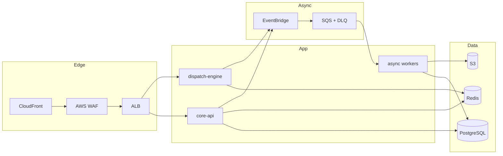

# FleetFeast Platform

FleetFeast is a production-oriented food delivery backend platform (FoodPanda/UberEats style) designed with Domain-Driven Design, explicit bounded contexts, and cost-aware AWS deployment patterns.

## What This Repo Contains

- `core-api/`: TypeScript modular core service covering identity, ordering, payments, settlement, support, risk/compliance, notifications, and observability.
- `dispatch-engine/`: Go real-time dispatch service for courier scoring, assignment, reassignment, and telemetry/ETA workflows.
- `contracts/`: versioned REST, gRPC/protobuf, and event schema contracts.
- `infra/`: infrastructure-as-code and environment delivery artifacts.
- `docs/`: requirements, architecture, deployment/cost, and execution plans.
- `tests/`: contract, resilience, security, load, infra, and release validation suites.

## Architecture At A Glance

- **Style**: modular monolith core + selectively extracted dispatch service.
- **Primary deployment**: AWS managed services.
- **Core runtime**:
  - Edge: CloudFront + WAF + ALB
  - App: ECS Fargate (`core-api`, `dispatch-engine`, workers)
  - Data: PostgreSQL, Redis, S3
  - Async: EventBridge + SQS (+ DLQ)
- **Boundaries**: each bounded context owns its write model and persistence contract.



## Domain-Driven Design Structure

### Ubiquitous Language (Core Terms)

`Order`, `Basket`, `Quote`, `Fulfillment`, `Courier Assignment`, `Settlement`, `Refund`, `Payout`, `Delivery Zone`, `SLA`, `Incident`.

### Bounded Contexts

- Identity
- Consumer Ordering
- Merchant Catalog
- Pricing & Promotions
- Order Orchestration
- Dispatch
- Payments
- Settlement
- Support
- Notifications
- Risk & Compliance
- Observability (cross-cutting)

### Context Mapping Principle

- Synchronous cross-context communication is allowed only through explicit service interfaces.
- Asynchronous communication uses canonical domain events.
- Direct cross-context table coupling is prohibited.
- Contract compatibility is enforced in CI.

## Runtime Component Responsibilities

- `core-api`
  - Public REST APIs (`/api/v1/consumer/*`, `/merchant/*`, `/courier/*`, `/admin/*`)
  - Domain orchestration and policy enforcement
  - Persistence and projection rebuild tooling
- `dispatch-engine`
  - Candidate scoring and assignment mode decisions
  - Reassignment flows for declines/timeouts/no-shows
  - Telemetry ingest and ETA responses
- Async workers
  - Notification fanout/retries/receipts
  - Financial and operational background workflows
  - Replay and failure-recovery paths

## Data Ownership and Persistence

- PostgreSQL is the source of truth for durable domain records.
- Redis is used for hot-path state/cache and low-latency operations.
- S3 stores statements, immutable evidence payloads, and large artifacts.
- Persistence mode supports local in-memory or durable store-backed repositories.

Design rules:

- One owning context per table/aggregate.
- No write access across context boundaries.
- Durable event outbox for replayable projections.
- Idempotent consumers for at-least-once delivery.

## API and Contract Model

### Public API Namespaces (v1)

- `/api/v1/consumer/*`
- `/api/v1/merchant/*`
- `/api/v1/courier/*`
- `/api/v1/admin/*`

### Internal Interfaces

- gRPC between orchestration and dispatch service.
- Internal control-plane endpoints under `/internal/*` for operational workflows.

### Event Catalog (Examples)

- `order.created.v1`
- `order.confirmed.v1`
- `order.cancelled.v1`
- `dispatch.assignment.requested.v1`
- `dispatch.assignment.completed.v1`
- `payment.authorized.v1`
- `payment.captured.v1`
- `refund.completed.v1`
- `settlement.generated.v1`
- `payout.released.v1`

Compatibility rules:

- additive changes within major version,
- breaking changes require major version bump (`/v2` or `.v2` topic),
- contract tests are release gates.

## Reliability, Security, and Compliance Baseline

### Reliability

- graceful degradation paths for provider outages and partial service failures,
- replay/rebuild workflows for timeline/projection recovery,
- DR objectives tied to RPO/RTO targets.

### Security

- least-privilege RBAC and scoped privileged flows,
- MFA for privileged identities,
- encryption in transit and at rest,
- secrets/keys managed through AWS controls.

### Compliance

- immutable audit records for high-risk operations,
- reason-code requirements for privileged interventions,
- evidence generation and verification workflows.

## Local Development and Verification

### Prerequisites

- Node.js 20+
- Go 1.22+
- Docker (for local Postgres/Redis when running durable mode)
- `gh` CLI (for GitHub automation)

### Run Core API

```bash
cd core-api
npm install
npm run dev
```

### Run Dispatch Engine

```bash
cd dispatch-engine
go test ./...
go run ./cmd/server
```

### Run Tests

```bash
cd core-api
npm test

cd ../dispatch-engine
go test ./...
```

## Runnable App Stack (Current)

You can run a connected local app slice (core backend + BFFs + consumer/courier/merchant/admin web apps) with:

```bash
npm run dev:web-stack
```

Then open:

- `http://127.0.0.1:3003` -> consumer web app
- `http://127.0.0.1:3004` -> courier web app
- `http://127.0.0.1:3001` -> merchant web app
- `http://127.0.0.1:3002` -> admin web app
- `http://127.0.0.1:3000/health` -> core-api health

Current app-layer connectivity:

- web apps call `ops-bff` routes under `/app/v1/*`,
- BFFs call backend routes under `/api/v1/*` and `/internal/*`,
- realtime gateway websocket baseline is active.

## Deployment and Costing

The deployment and costing strategy is documented as staged environments (`dev`, `staging`, `prod`) with phased spend controls and guardrails.

See:

- `docs/architecture/system-architecture-v1.md`
- `docs/architecture/app-architecture-v1.md`
- `docs/architecture/deployment-and-cost-estimates.md`
- `docs/architecture/api-and-event-contracts-v1.md`
- `docs/requirements/functional-requirements-ddd.md`

## Current Backend Status

Implemented backend includes:

- identity/session/RBAC/MFA/break-glass,
- merchant catalog and consumer ordering lifecycle,
- order orchestration with cancellation matrix and timeline,
- dispatch integration and telemetry support,
- payment authorization/capture/COD/refunds with audit trail,
- settlement ledger/payout scheduling/statements,
- support ticketing/interventions/SLA escalations,
- risk policy/manual review/compliance audit pipelines,
- notification fanout/templates/retries/receipts,
- observability logs/SLO signals and durability-focused persistence tests.
