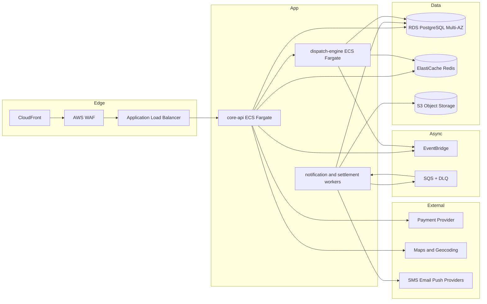

# FoodPanda-Style Platform System Architecture (V1)

- Version: `1.0.0`
- Date: `2026-02-16`
- Scope: `Balanced V1` for `US single metro`
- Deployment target: `AWS managed services`

## 1. Architecture Summary

This architecture uses a modular monolith core (TypeScript) for most bounded contexts and one selective extracted Go service for dispatch and real-time telemetry workloads. The model prioritizes delivery speed for a lean team while maintaining strict domain boundaries and production-grade controls for enterprise compliance.

### 1.1 Goals

- Strong DDD boundary enforcement from day one
- Fast delivery with minimal operational overhead
- Built-in reliability, auditability, and security controls
- Cost discipline under the `<$8k` monthly infrastructure target at early scale

### 1.2 Non-Goals

- Full microservice decomposition in phase 1
- Multi-region active-active from day one
- Multi-country regulatory variants

## 2. Architecture Style And Decomposition

## 2.1 Style

- Core: modular monolith (`TypeScript`) deployed as ECS Fargate service (`core-api`)
- Selective service: Go-based dispatch service (`dispatch-engine`) for matching and telemetry-heavy logic
- Event-driven asynchronous workflows via EventBridge + SQS

### 2.2 Bounded Context To Runtime Mapping

| Bounded Context | Runtime Unit | Language | Persistence Ownership |
|---|---|---|---|
| Identity | `core-api.identity` module | TypeScript | Postgres `identity_*` tables |
| Consumer Ordering | `core-api.ordering` module | TypeScript | Postgres `ordering_*`, Redis cache |
| Merchant Catalog | `core-api.catalog` module | TypeScript | Postgres `catalog_*`, S3 assets |
| Pricing & Promotions | `core-api.pricing` module | TypeScript | Postgres `pricing_*`, Redis |
| Order Orchestration | `core-api.orchestration` module | TypeScript | Postgres `orders_*`, event outbox |
| Payments | `core-api.payments` module | TypeScript | Postgres `payments_*`, secure token refs |
| Settlement | `core-api.settlement` module | TypeScript | Postgres `ledger_*`, S3 statements |
| Support | `core-api.support` module | TypeScript | Postgres `support_*` |
| Notifications | `core-api.notifications` worker | TypeScript | SQS queues, S3 templates |
| Risk & Compliance | `core-api.risk` module | TypeScript | Postgres `risk_*`, immutable S3 logs |
| Dispatch | `dispatch-engine` service | Go | Redis hot state + Postgres projection |

### 2.3 Module Isolation Rules

- Internal module APIs only; no cross-module direct table reads.
- Cross-context access must use:
  - synchronous module interface contracts,
  - or published domain events.
- Shared utility packages cannot embed domain logic.
- DB access policy enforces schema-level ownership by module.

## 3. Runtime Components

### 3.1 Topology

### 3.2 Component Responsibilities

| Component | Responsibility | Scaling Axis |
|---|---|---|
| CloudFront | CDN caching, edge termination, static/API acceleration | Requests/sec |
| WAF | Request filtering, IP/rate rules, managed protections | Requests/sec |
| ALB | Layer-7 routing to core and dispatch targets | Concurrent connections |
| `core-api` | REST APIs, orchestration, domain modules | CPU + request concurrency |
| `dispatch-engine` | Assignment scoring, telemetry ingestion, ETA updates | CPU + telemetry events/sec |
| Worker services | Async notifications, settlement, retries, DLQ processing | Queue depth |
| RDS PostgreSQL | System of record and ledger consistency | IOPS + connection pool |
| Redis | Hot read cache, session and routing short-lived state | Memory + ops/sec |
| EventBridge | Domain event routing | Events/sec |
| SQS | Durable async buffering and retries | Queue depth |
| S3 | Statements, templates, audit evidence and immutable logs | Object size and count |

## 4. Data And Interface Architecture

### 4.1 Data Ownership Rules

- Each bounded context has owned tables and write authority.
- Read sharing uses:
  - explicit query APIs,
  - read projections,
  - or event-driven materialized views.
- Direct cross-context joins are prohibited.
- Outbox pattern required for state-change events from transaction boundaries.

### 4.2 Public API Surface (v1)

- `/api/v1/consumer/*`
- `/api/v1/merchant/*`
- `/api/v1/courier/*`
- `/api/v1/admin/*`

API principles:

- idempotency keys required for create/update financial actions,
- pagination and filtering standardized,
- machine-readable error codes and policy denial reasons.

### 4.3 Internal Contracts

- gRPC between `core-api.orchestration` and `dispatch-engine`:
  - `DispatchService/Score`
  - `DispatchService/Assign`
  - `DispatchService/Reassign`
  - `DispatchService/UpdateTelemetry`

Contract constraints:

- backward-compatible fields only inside major version,
- explicit defaulting semantics for new fields,
- protobuf evolution rules enforced in CI.

### 4.4 Event Contracts

Canonical topics:

- `order.created.v1`
- `order.confirmed.v1`
- `order.cancelled.v1`
- `dispatch.assignment.requested.v1`
- `dispatch.assignment.completed.v1`
- `payment.authorized.v1`
- `payment.captured.v1`
- `refund.completed.v1`
- `settlement.generated.v1`
- `payout.released.v1`

Event rules:

- schema registry-backed validation,
- idempotency key in event envelope,
- exactly-once effect through idempotent consumers,
- DLQ routing with retry classification.

## 5. Realtime Tracking And Courier Telemetry Flow

### 5.1 Flow

1. Courier app sends telemetry (`lat/lon`, heading, speed, timestamp).
2. ALB routes telemetry ingest to `dispatch-engine`.
3. Dispatch validates ordering and staleness.
4. ETA recompute runs on bounded interval.
5. Updated ETA event published.
6. Consumer timeline and courier/merchant views refresh via event projection.

### 5.2 Backpressure Strategy

- Per-courier ingestion rate limit (token bucket).
- Duplicate timestamp drop and out-of-order rejection threshold.
- Queue telemetry bursts in SQS buffer during peak.
- Low-priority ETA recalculation downgrade mode during incident.

### 5.3 Retry Policy

- Client retry with jitter for `429` and transient `5xx`.
- Server-side retries only on safe idempotent telemetry writes.
- Max retry count and dead-letter transition after exhaustion.

## 6. Reliability, Security, And Compliance Architecture

### 6.1 Reliability Targets

- Checkout and order lifecycle APIs: `99.9%` monthly availability
- Critical read APIs: `p95 < 400 ms`
- Checkout critical path: `p95 < 700 ms`
- RPO: `<= 15 min`
- RTO: `<= 60 min`

### 6.2 Graceful Degradation Matrix

| Failure Condition | Degraded Behavior | Recovery Trigger |
|---|---|---|
| Dispatch service unavailable | Fallback to basic rules assignment path | `dispatch-engine` health recovery |
| Notification provider outage | Queue + delayed retries + support-visible warning | provider ACK success threshold |
| Maps API degraded | Cached ETA and zone approximation | maps health endpoint recovery |
| Payment provider transient failures | Retry/void logic and at-risk order flag | PSP recovery and reconciliation pass |
| Projection lag exceeds threshold | Rebuild timeline from event log | projection caught-up checkpoint |

### 6.3 Security Controls

- IAM least privilege with service-specific roles.
- End-to-end TLS 1.2+ and mTLS for internal gRPC where feasible.
- KMS encryption for DB, S3, and secrets.
- Secrets manager for API keys and credentials.
- WAF managed rules + custom abuse/rate rules.
- Mandatory MFA for privileged users.

### 6.4 Compliance Controls

- Immutable audit logging for payment/refund/payout/admin actions.
- Policy decision logging for allow/deny/review outcomes.
- Evidence jobs for control operation proofs.
- Support and admin intervention reason-code enforcement.

## 7. Backup, DR, And Continuity

### 7.1 Backup Strategy

- RDS automated backups and PITR window aligned to RPO.
- S3 versioning and object-lock mode for immutable logs.
- Configuration backups for IaC states and CI/CD manifests.

### 7.2 DR Strategy

- Single-region primary with warm-standby procedures.
- Periodic restoration drills for DB and S3 evidence.
- DR runbook automation for role, secret, and service bootstrap.

### 7.3 DR Validation

- Monthly restore test for sampled production snapshots.
- Quarterly failover simulation.
- Release gate fails if DR evidence is stale (>30 days for critical checks).

## 8. Delivery Architecture

### 8.1 Environments

- `dev`: rapid iteration, synthetic test data
- `staging`: production-like environment, pre-release gates
- `prod`: hardened controls and strict change windows

### 8.2 CI/CD Gates

1. Static checks and unit tests
2. Contract tests (REST, gRPC, event schema)
3. Security scans (SAST, dependency, IaC policy)
4. Integration tests with ephemeral environments
5. Performance smoke tests
6. Approval workflow for production promotion

### 8.3 Deployment Strategy

- Core API: blue/green deployment with health and latency gates.
- Dispatch engine: canary rollout with assignment accuracy and SLA guardrails.
- Async workers: rolling strategy with queue drain thresholds.

### 8.4 Rollback Strategy

- Automatic rollback on SLO breach alarms.
- Manual rollback runbook for schema-incompatible or dependency-related incidents.
- Event replay and projection rebuild procedures for eventual consistency repair.

## 9. Observability And Operations

### 9.1 Telemetry Standards

- OpenTelemetry traces with correlation IDs across API + async paths.
- Structured JSON logs with actor, order, and request identifiers.
- Business metrics:
  - checkout success,
  - assignment latency,
  - cancellation reasons,
  - refund cycle time,
  - payout mismatch rate.

### 9.2 Alerting

- SLO-based paging for critical endpoints.
- Queue depth and DLQ alarms.
- Payment/refund/payout anomaly alerts.
- Audit trail write-failure alerts (highest severity).

### 9.3 Operational Tooling

- Admin operational console for controlled interventions.
- Support timeline view with correlated event traces.
- Finance reconciliation dashboard with exception queues.

## 10. Evolution Plan

### 10.1 Extraction Triggers

Extract additional services from the modular core only when at least one trigger is met:

- sustained `>60%` CPU in module-specific paths,
- release cadence blocked by unrelated domain changes,
- data scale isolation required for reliability/compliance,
- team ownership boundaries no longer manageable in a single deployable.

### 10.2 Candidate Next Extractions

1. Payments service
2. Notification service
3. Settlement service

## 11. Architecture Acceptance Criteria

This architecture is acceptable when:

- every `FR-*` requirement in the FRD maps to a runtime component and interface,
- all critical contracts are represented in `api-and-event-contracts-v1.md`,
- deployment model and DR model support target RPO/RTO,
- security/compliance controls are represented as enforceable gates,
- the cost model in `deployment-and-cost-estimates.md` is consistent with this topology.
